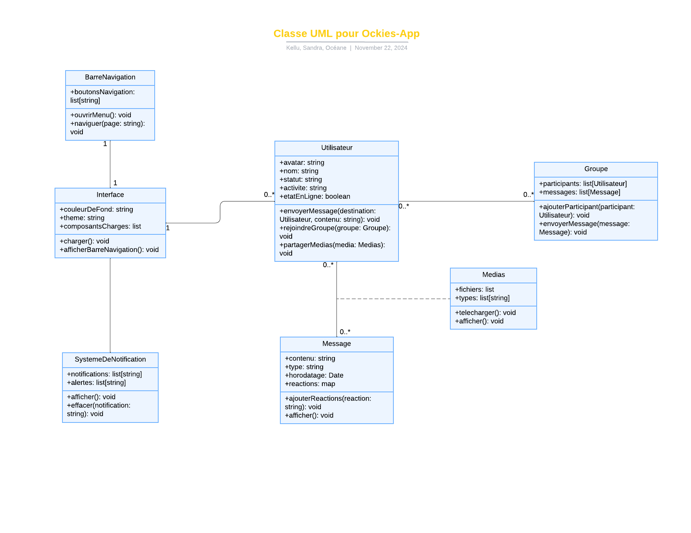

# **Fonctionnalité** ⚙️🚀

1. **Analyse de l'interface** : 🧐
   - Identifier les nouvelles fonctionnalités ou différences.
   - Proposer un diagramme de classes mis à jour.

2. **Liste des couleurs** :🎨🌈
   - Déterminer les couleurs principales utilisées dans l'interface.

3. **Composants réutilisables** : 👯‍♀️
   - Lister les composants d'interface pouvant être réutilisés dans d'autres parties du projet.

### Étape 1 : Analyse des fonctionnalités 🤓🧐
L'interface présente des fonctionnalités supplémentaires ou modifiées :✨

- **Profil utilisateur** visible avec un avatar, nom, et statut.👤

- **Liste des utilisateurs en ligne**.👥🟢

- **Messagerie en groupe et individuelle** avec état (ex. "is typing", messages vocaux, images partagées).🗣️💌

- **Médias partagés** visibles dans la conversation (images, fichiers, etc.).🎇🤳

- **Participants au groupe** listés avec leurs statuts.

- 💻 Indication d'activité comme "D-Live".🫂

---

### 🎨 Étape 2 : Liste des couleurs 🌈

Voici les couleurs principales :
1. **Fond** : #1C1C1E (gris foncé ou noir) ⚫️🦨
2. **Texte principal** : #FFFFFF (blanc) ⚪️
3. **Texte secondaire** : #A0A0A0 (gris clair) 👽
4. **Accent principal** : #007BFF (bleu vif) 💙🧢
5. **Éléments interactifs** : #FFD700 (jaune doré pour notifications) 🍌🎗️
6. **Réactions/emojis** : #FF4500 (orange vif)🍊
7. **Médias partagés** : Couleurs variées selon le type (ex. icônes). 🌳🍑🌕🍓🌈

---

### Étape 3 : Composants réutilisables 🍽️

1. **Avatar utilisateur** : 🙋‍♀️
   - Circulaire, avec photo et statut (en ligne/hors ligne).🟢

2. **Liste de contacts/groupes** :👯‍♀️
   - Icônes alignées verticalement.
   - Indicateurs d'état (notification, activité).

3. **Carte de message** : 💬
   - Contient texte, image, audio ou fichier.
   - Ajout de réactions sous forme d'icônes.

4. **Panneau latéral droit** :  📋
   - Liste des participants.
   - Section "Médias partagés" (images et fichiers téléchargeables).🖇️

5. **Barre de navigation supérieure** : 🚣‍♀️
   - Boutons de paramètres et menu (ex. trois points).

6. **Barre de saisie de message** : 🤳
   - Icône de pièce jointe.📧
   - Zone de saisie de texte.
   - Bouton "Envoyer". 📨

---
---

# **Diagramme de classe**

Voici un diagramme de classe basé sur votre description, intégrant les fonctionnalités, composants, et autres éléments décrits : 

---

### **Diagramme de Classe**

Les classes principales sont :

1. **Utilisateur**
2. **Message**
3. **Groupe**
4. **Médias**
5. **Interface**
6. **BarreNavigation**
7. **SystèmeDeNotification**

---

### Explication des classes 🤓

1. **Utilisateur** 🐥

   - Attributs : inclut l'avatar, le nom, le statut, l'activité et l'état en ligne. 

   - Méthodes : envoyer des messages, rejoindre des groupes, partager des médias.  

2. **Message** 📧
   - Attributs : contenu (texte, audio, image, fichier), type, horodatage, et réactions. 

   - Méthodes : ajouter des réactions et afficher un message.  

3. **Groupe** 🏘️
   - Attributs : inclut les participants et les messages d'un groupe.  

   - Méthodes : ajouter un participant et envoyer des messages dans le groupe.  

4. **Médias**  
   - Attributs : contient les fichiers partagés et leurs types (image, vidéo, etc.). ⛺️

   - Méthodes : télécharger et afficher des médias.  

5. **Interface** 💻
   - Attributs : couleur de fond, thème, et composants chargés.  🖍️

   - Méthodes : charger l'interface, afficher la barre de navigation.  

6. **BarreNavigation**  ⛵️
   - Attributs : boutons pour la navigation.  

   - Méthodes : ouvrir un menu et naviguer entre les pages.  

7. **SystèmeDeNotification**  📳
   - Attributs : notifications et alertes (contenu et type).  

   - Méthodes : afficher et effacer les notifications.  

Si vous avez besoin de modifier ou d'ajouter des détails, je suis là pour vous aider ! 😊